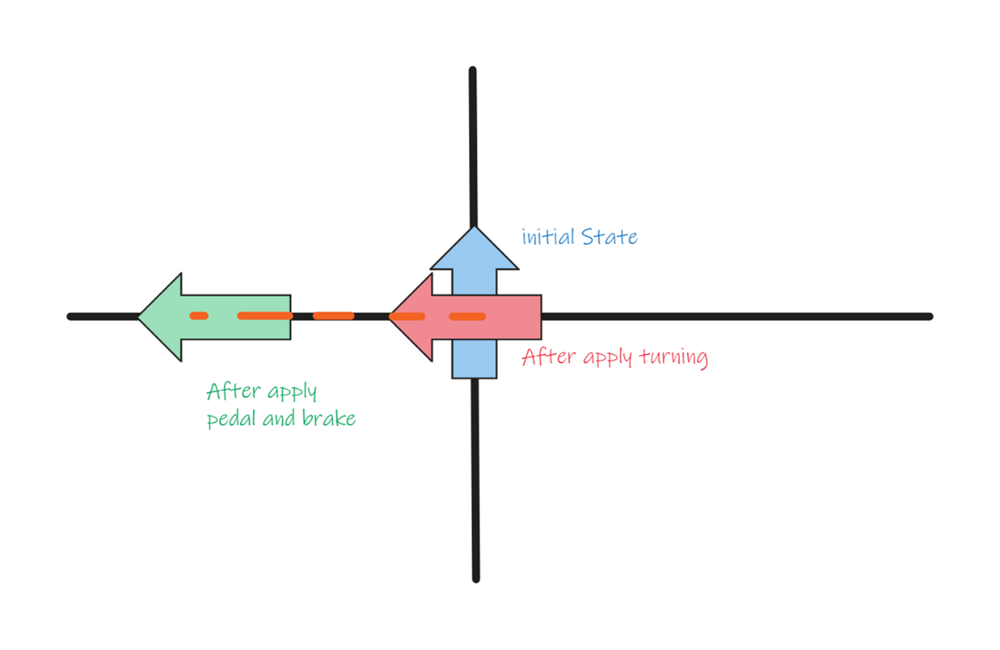

# Implementation Details

## Bikers and MultiBike Forces

1. **Agent Parameters:**
   - Each agent has three parameters: Pedaling, Braking, and Turning forces.

2. **MegaBike Physics Parameters:**
   - MegaBike parameters for physics engine include Velocity and Orientation.

3. **Orientation Value:**
   - The current value of orientation for MegaBike is referred to as the offset.

4. **Turning Angle Calculation:**
   - The Turning Angle depends only on the Turning force. To calculate it, sum up the turning force from different agents (optionally taking the average turning force) and map it to a range of -180 to 180 degrees.

5. **Orientation Update:**
   - The updated Orientation is calculated by adding the Turning Angle to the Offset: `Offset = Offset + Turning Angle`.

6. **Post-Turning Forces Application:**
   - After turning, all the pedaling force and braking force will be applied in the direction of the updated orientation.

7. **Velocity Constraint:**
   - The Velocity will not drop below zero; hence, the bike will not move backwards.

 
